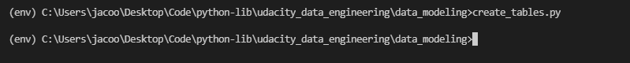
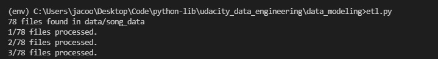
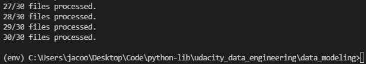
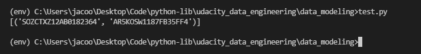

# data_modeling

A simple project that reads data from json files and stores in a star schema PostgreSQL database.

Note that the data files aren't stored here under revision control.

## Code Execution

Execute the following commands in Python.

1. Create an SQL database and tables.

    ``` python
    create_tables.py
    ```

    

2. Process json files and load into SQL tables.

    ``` python
    etl.py
    ```

    

    

3. Verify the results by running test.py. This produces the one record in the songplays table with a song_id.

    ```python
    test.py
    ```

    

## Local Setup

### Local PostgreSQL Database

1. Download and setup a local [PostgreSQL database](https://www.postgresql.org/)
2. Create a student user role utilizing the psql terminal.

    ```psql
    CREATE USER student WITH PASSWORD 'student';
    ```

3. Give required persmissions to the newly created role.

    ``` psql
    ALTER USER student createdb;
    ```

4. Create a studentdb database using the psql termainal.

    ``` psql
    CREATE DATABASE studentdb;
    ```

### Local Python Environment

Create and activate a virtual environment, then install required dependancies.

```cmd
python -m venv env
.\Scripts\env\activate
pip install -r requirements.txt
```
