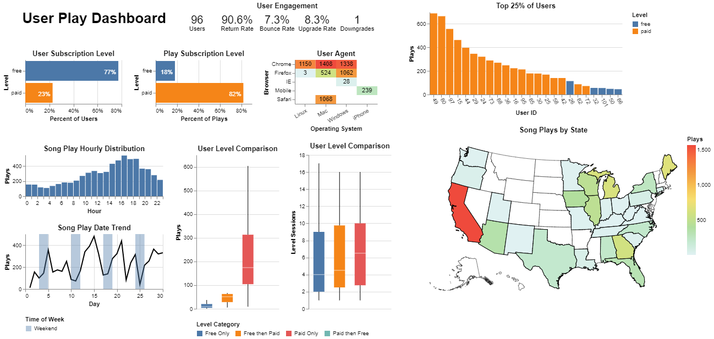

# Sparkify User Song Plays

An Amazon Web Services ETL process that allows the music streaming company Sparkify to answer analytical questions about user song plays.

Data is first copied from files in AWS S3 buckets into Redshift staging tables. Using the COPY command allows files to be processed in parallel to enhance speed. Finally data is copied from the staging tables, transformations are made, and then inserted into the final analytic tables. The column-oriented Redshift database allows for analytic queries to be answered more efficently than if stored in a row-oriented database.

[Log Data S3 Bucket](https://s3.console.aws.amazon.com/s3/buckets/udacity-dend/log_data/)

[Song Data S3 Bucket](https://s3.console.aws.amazon.com/s3/buckets/udacity-dend/song_data/)

The final product produces the following dashboard, built using the Python package [Altair](https://altair-viz.github.io/).



## Key Dashboard Points

Keep in mind that part of the data for this project was generated using an event simulator.

- 7.3% of users (bounce rate), only use the service once. 8.3% of users upgrade fom free to paid.
- 1 user downgraded from paid to free. On investigation they later upgraded back to paid, so that was likely a mistake.
- Most users are at the free subscription level, but most plays come from paid users.
- Most song plays are between 14:00 and 18:00.
- There isn't a large mobile play footprint.
- Users upgrade from free to paid on average at 50 plays. Users that stay at a free only level have roughly 10 plays.
- Not a strong differentiation between user level category for session count.
- 5 free users are in the top 25% of plays. They would be good targets for seeking an upgraded subscription.
- Most plays are in California, followed by a grouping in the upper midwest.

## Extra Credit

- additional dashboard.py script to create a dashboard with aggregations in SQL for performance
- user_levels SQL query to categorize users by free only, paid only, free then paid, paid then free (potentially useful for data science tasks)
- additional infrastructure.py script to create and delete Redshift infrastructure, along with automatically saving config params to dwh.cfg
- sql_queries.py Redshift copy allows for errors and truncates strings to fit schema
- etl.py has additional queries to display Redshift copy errors that were ignored
- additional test_etl.py script to ensure primary keys are unique, display size of tables, and check for possible truncation during Redshift COPY

### Copy Logic

Redshift copy allows errors and truncates strings on the basis that if either of these situations occur, they are clearly exposed to the end user. This forgiving approach is used to prevent the entire ETL process from failing.

1. String truncation is allowed as erroneous logging has been observed in the source S3 files.
2. Copy errors are allowed as a catch all for any other type of error.

## Wishlist

A list of items that should be implemented, but were not as they may affect the grading of this project.

- Implement user_levels SQL query during ETL process to prevent needing to run a complicated query.
- Move user agent parsing in dashboard.py script to ETL process.

### user_levels

A sample of the user_level query transformation is shown below. Ideally this should be part of the ETL process to prevent exposure to the end user.

Sample for user_id 15 after simple grouping for session_id.

|user_id |session_id  |level  |start_time  |play_count |
|--------|------------|-------|------------|-----------|
|15      |172         |paid   |2018-11-02  |74         |
|15      |199         |paid   |2018-11-03  |27         |
|15      |221         |paid   |2018-11-07  |101        |
|15      |362         |paid   |2018-11-09  |9          |
|15      |417         |paid   |2018-11-13  |2          |
|15      |557         |paid   |2018-11-14  |18         |
|15      |582         |paid   |2018-11-15  |5          |
|15      |612         |paid   |2018-11-19  |10         |
|15      |716         |paid   |2018-11-20  |59         |
|15      |818         |paid   |2018-11-21  |70         |
|15      |764         |free   |2018-11-21  |66         |
|15      |834         |paid   |2018-11-26  |22         |

Final output for analytic dashboard and data science tasks. This could be used to make predictions, target users for upgrades, etc. It involves many analytical windowing functions that could be part of the ETL process.

|user_id |index | current |previous |next |sessions |play_count |level_days |start_time |
|--------|------|---------|---------|-----|---------|-----------|-----------|-----------|
|15      |1     |paid     |free     |null |2        |92         |4          |2018-11-21 |
|15      |2     |free     |paid     |paid |1        |66         |0          |2018-11-21 |
|15      |3     |paid     |null     |free |9        |305        |17         |2018-11-02 |

## Quick Start

Below is a brief overview of the steps to perform. More detail is included in additional sections.

1. Activate a Python environment and install required packages defined in `requirements.txt`.
2. Set configuration parameters in `dwh.cfg`.
3. (Optional for Infrastructure as Code) Define additional [INFRASTRUCTURE] section in `dwh.cfg`. INFRASTRUCTURE/KEY and INFRASTRUCTURE/SECRET are manually generated in the AWS console.
4. (Optional for Infrastructure as Code) Execute `infastructure.py create` to create Redshift infrastructure.
5. Execute `create_tables.py`.
6. Execute `etl.py`.
7. (Optional Test) Execute `test_etl.py` to ensure primary keys are unique, display size of tables, and check for possible truncation during Redshift COPY.
8. (Optional for Dashboard) Execute `dashboard.py` to display the analytical dashboard.
9. (Optional for Infrastructure as Code) Execute `infastructure.py delete` to delete Redshift infrastructure.

### Step 1: Python environment and requirements.txt

Commands below are shown for Windows.

``` cmd
python -m venv env
.\env\Scripts\activate
pip install -r requirements.txt
```

### Step 2: dwh.cfg

The following fields are required.

```cfg
[CLUSTER]
HOST = XXX
DB_NAME = XXX
DB_USER = XXX
DB_PASSWORD = XXX
DB_PORT = 5439

[IAM_ROLE]
ARN = XXX

[S3]
LOG_DATA = 's3://udacity-dend/log_data'
LOG_JSONPATH = 's3://udacity-dend/log_json_path.json'
SONG_DATA = 's3://udacity-dend/song_data'
```

The additional section is required for running infrastucture.py to create/delete Redshift infrastructure.

```cfg
[INFRASTRUCTURE]
REGION = XXX
KEY = XXX
SECRET = XXX
STATUS_CHECK_ATTEMPTS = 5
STATUS_CHECK_DELAY_SEC = 30
ROLE_NAME = songplays_S3toRedshiftStaging
CLUSTER_IDENTIFIER = sparkify
CLUSTER_TYPE = multi-node
NODE_TYPE = dc2.large
NUM_NODES = 2
```

### Step 3: dwh.cfg key and secret

INFRASTRUCTURE/KEY and INFRASTRUCTURE/SECRET are manually generated in the AWS console using the steps below.

1. Navigate to IAM / Access Management / Users / Add users
2. User name = user_song_plays_setup
3. Select AWS credential type = Access key - Programatic access
4. Next: Permissions
5. Attach existing policies directly
6. Select AdministratorAccess
7. Next: Tags
8. Next: Review
9. Create user
10. Copy the provided values to the NFRASTRUCTURE section of dwh.cfg

### Step 4: infastructure.py (create)

Run the script to create the Redshift cluster infrastructure.

``` cmd
infrastructure.py create
```

Output

``` cmd
Creating Redshift IAM Role YYYY.
Attaching Redshift IAM Role YYYY policy for S3 read only access.
Creating Redshift cluster sparkify.
Creating database user_song_plays in Redshift cluster.
Checking cluster availability. Attempt 0/4.
Waiting 30 seconds before checking cluster availability.
Redshift cluster sparkify is available.
Opening Redshift cluster TCP port 5439 for external access.
Setting [IAM_ROLE][ARN]=arn:aws:iam::XXX:role/YYY in config file dwh.cfg.
Setting [CLUSTER][HOST]=ZZZ.us-west-2.redshift.amazonaws.com in config file dwh.cfg.
```

### Step 5: create_tables.py

Run the script to create the Redshift tables.

``` cmd
create_tables.py
```

Output

```cmd
Dropping tables if they exist:
['staging_events', 'staging_songs', 'songplay', 'users', 'songs', 'artists', 'time'].
Creating tables:
['staging_events', 'staging_songs', 'users', 'songs', 'artists', 'time', 'songplay'].
```

### Step 6: etl.py

Run the script to copy data from S3 to the Redshift staging tables. Data is then inserted from the staging tables into the final analytical tables.

``` cmd
etl.py
```

Output

``` cmd
Beginning copy from S3 bucket 's3://udacity-dend/log_data' into table staging_events.
Completed copy from S3 bucket 's3://udacity-dend/log_data' into table staging_events in 3.14 seconds.
No errors occured loading into table staging_events.
Beginning copy from S3 bucket 's3://udacity-dend/song_data/' into table staging_songs.
Completed copy from S3 bucket 's3://udacity-dend/song_data/' into table staging_songs in 352.68 seconds.
No errors occured loading into table staging_songs.
Inserting data into table songplay.
Inserting data into table users.
Inserting data into table songs.
Inserting data into table artists
```

Any errors that occur will be written to a json file beginning with the name stl_load_errors. An example of which is given below. It gives the column name, reason for the error, and source file name of the error.

```json
{
    "artist_location": [
        {
            "err_reason": "String length exceeds DDL length",
            "filename": "s3://udacity-dend/song-data/A/Y/F/TRAYFUW128F428F618.json"
        }
    ]
}
```

### Step 7: test_etl.py

Run the test script to check the result of the etl process to ensure that:

- values were inserted into tables
- primary key values are unique since Redshift doesn't enforce this
- see if string values were possibly truncated

``` cmd
test_etl.py
```

Output

``` cmd
PossibleCopyStringTruncation: Possible truncated string values during copy from S3 to Redshift.
0>col_percent<100% has truncated records.
col_percent=100% is possibly truncated (all values may be equal to the max column length by design).
               table_name column_name  col_percent  character_maximum_length
0  staging_events      method        100.0                         3
1  staging_events       level        100.0                         4
2   staging_songs   artist_id        100.0                        18
3  staging_events      gender        100.0                         1
4   staging_songs     song_id        100.0                        18
  warnings.warn(msg, PossibleCopyStringTruncation)

Tables contain no duplicated primary key values.

Record count for each non-staging table: {'artists': 9553, 'songplay': 6820, 'songs': 14896, 'time': 6813, 'users': 97}
```

### Step 8: dashboard.py

```cmd
dashboard.py
```

This will automatically open an HTML dashboard in a web browser.

### 9: infrastructure.py (delete)

***Carefully*** run the script to delete the Redshift infrastructure. This will delete everything without creating a snapshot or backup.

``` cmd
infrastructure.py delete
```

Output

``` cmd
Deleting Redshift cluster sparkify.
Checking cluster deletion. Attempt 0/4.
Waiting 30 seconds before checking cluster deletion.
Checking cluster deletion. Attempt 1/4.
Waiting 30 seconds before checking cluster deletion.
Checking cluster deletion. Attempt 2/4.
Waiting 30 seconds before checking cluster deletion.
Redshift cluster sparkify has been deleted/does not exist.
Detaching S3 Policy from IAM Role songplays_S3toRedshiftStaging.
Deleting IAM Role songplays_S3toRedshiftStaging.
```
